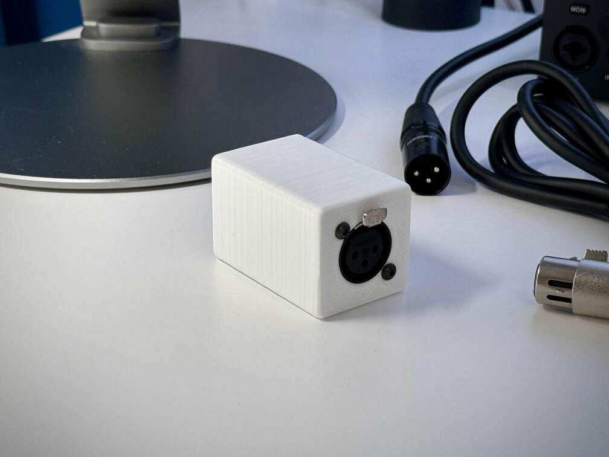
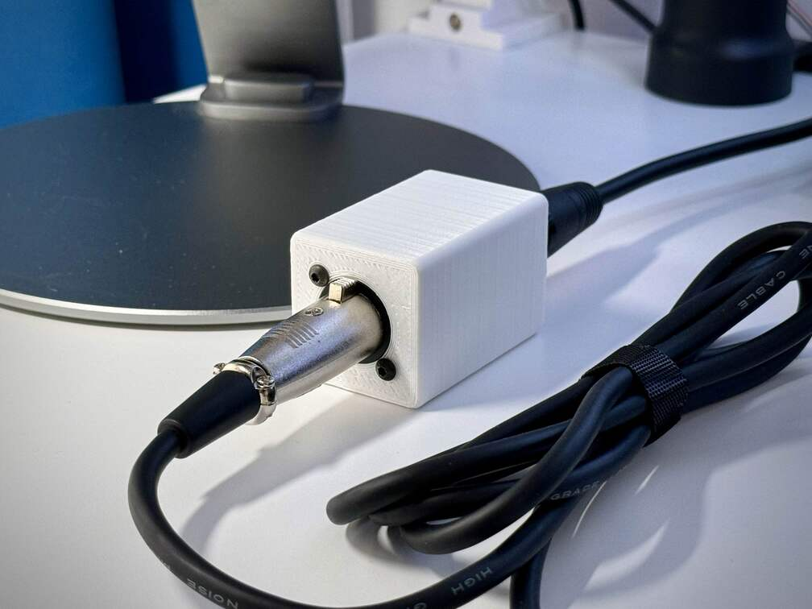
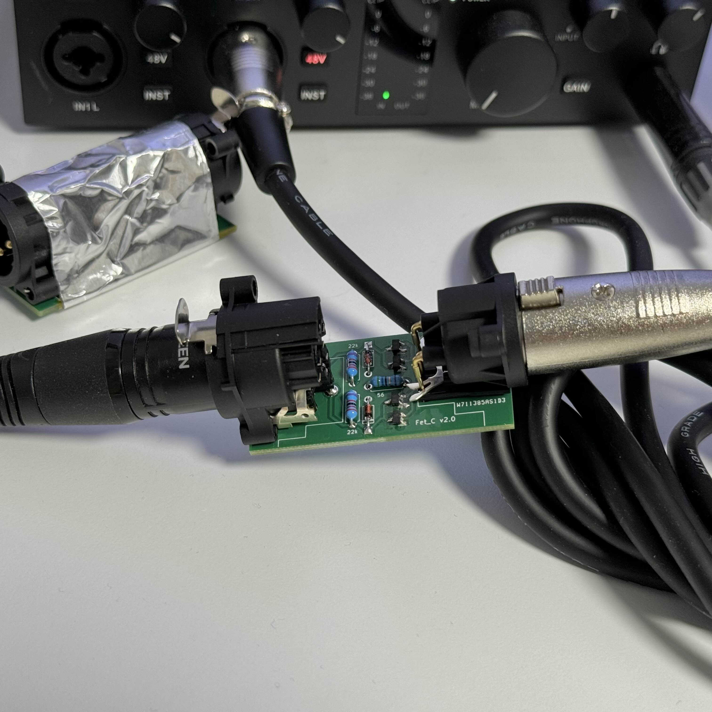
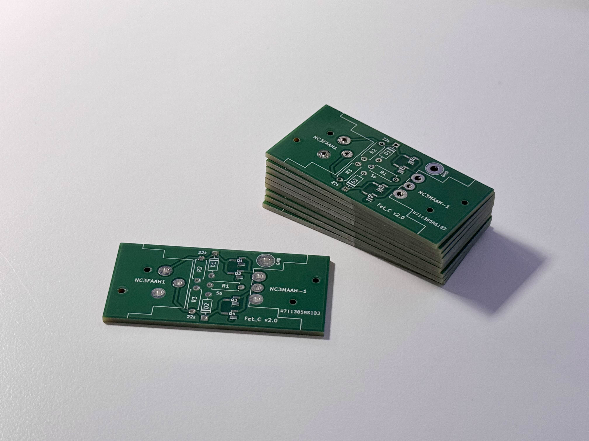

# Fet_C-inline-preamp

  
  
  
  

## Project Introduction
Fet_C is a DIY inline preamplifier project utilizing JFETs (Junction Field-Effect Transistors).
This device amplifies signals from low-output dynamic and ribbon microphones to line level.

## Features
- Simple circuit design with minimal component count
- PCB gerber files provided for easy fabrication
- 3D printable case design (STL files included)
- Moderate soldering skills required (includes 4 SMD components)

## Required Materials
- PCB (fabricated using provided gerber files)
- 3D printed case (fabricated using provided STL files)
- NC3FAAH1 [1]
- NC3MAAH-1 [1]
- 2SK209-GR(TE85L,F) [4]
- 1N4148 [2]
- 56Ω 0.1% resistor [1]
- 22KΩ 0.1% resistor [2]
- M3 screws (for case assembly) [4]
- Soldering equipment and materials

**Note**: Most electronic components can be purchased from suppliers such as Digikey.
