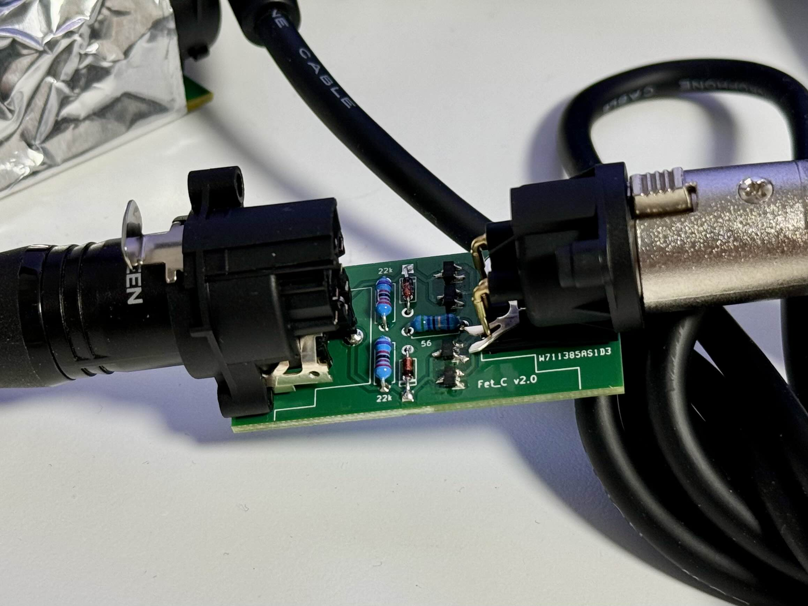

# Fet_C-inline-preamp

  
  
  
  

## Project Introduction

Fet_C is a DIY inline preamplifier project based on JFET technology.   
This device amplifies signals from low-output dynamic and ribbon microphones, adjusting them to line level.

## Features

- Simple circuit design with minimal component count
- PCB gerber files provided
- 3D printable case STL files available
- Some soldering experience required (4 SMD components)

## Required Materials

- NC3FAAH1 [1 piece]
- NC3MAAH-1 [1 piece]
- 2SK209-GR(TE85L,F) [4 pieces]
- 1N4148 [2 pieces]
- 56Ω 0.1% resistor [1 piece]
- 22KΩ 0.1% resistor [2 pieces]
- M3 screws (for case assembly)
- Soldering equipment and materials

**Note**: Most components can be purchased from electronic component suppliers such as Digikey.
